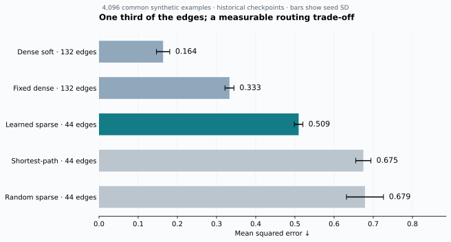
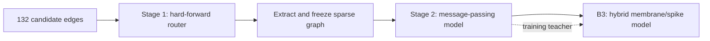
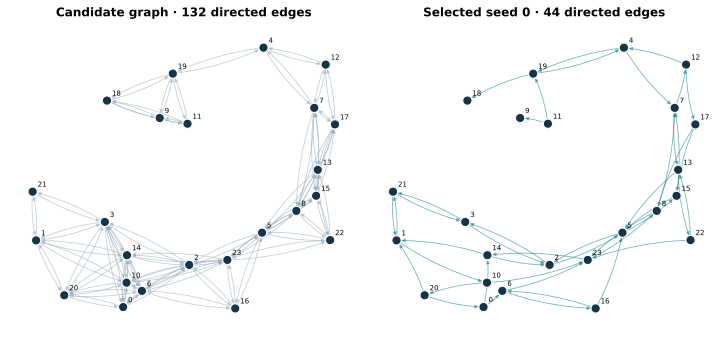

# Dynamic Connectome

[](https://github.com/nokdon/dynamic-connectome/actions/workflows/tests.yml)

**Learning a sparse communication graph, then computing over it with message passing and hybrid spiking dynamics.**

An eight-dimensional signal starts at one of 24 nodes. A designated target node must recover it using a limited number of communication steps. Dynamic Connectome learns which edges to retain, freezes the resulting graph, and studies the accuracy–connectivity trade-off in JAX.

The released sparse checkpoints retain **44 of 132 candidate edges**. On a new, shared set of 4,096 synthetic examples, they achieve **0.509 MSE**, about **25% below the evaluated random sparse controls**. Dense models remain more accurate. This is a controlled routing research prototype; it does not establish biological topology recovery or hardware efficiency.



## Run it

Python 3.12 or newer; the verified environment uses Python 3.13 and the CPU backend. Clone the repository using an account with access, then install from its root:

```bash
git clone https://github.com/nokdon/dynamic-connectome.git
cd dynamic-connectome
python -m venv .venv
source .venv/bin/activate
python -m pip install -r requirements-lock.txt
python -m pip install --no-deps -e '.[dev,plots]'
JAX_PLATFORMS=cpu dc demo
```

The demo loads four small bundled checkpoints and needs no download, dataset, teacher model, GPU, or credentials. Its 64 examples are a functionality check, not the result table below. Initial execution includes JAX compilation.

```bash
# Re-evaluate all 26 checkpoints on the documented common draws.
JAX_PLATFORMS=cpu dc evaluate --output outputs/evaluation.json

# Exercise training, graph extraction, validation selection and final testing.
JAX_PLATFORMS=cpu dc train --config configs/smoke.json --output outputs/my-smoke

# Train the same pipeline with the larger, fully specified research schedule.
JAX_PLATFORMS=cpu dc train --config configs/research.json --output outputs/my-run

# Train all four control families, matching this run's graph for the random control.
JAX_PLATFORMS=cpu dc train-baselines --config configs/research.json --reference-artifacts outputs/my-run --output outputs/my-controls

# Evaluate the newly trained artifacts on another draw seed.
JAX_PLATFORMS=cpu dc evaluate --artifacts outputs/my-run --seed 20260917

JAX_PLATFORMS=cpu pytest -q
dc plot --report results/checkpoint_evaluation.json --output outputs/figures
```

Output paths must be new. The research schedule is a new validation-selected protocol; running it is not expected to reproduce historical training-batch minima. See [reproducibility](docs/reproducibility.md) for the precise distinction.

## How it works



1. **Learn the structure.** A straight-through estimator differentiates through a hard, two-slot router. An open-row budget and connectivity objective shape the graph.
2. **Freeze and train computation.** Only the message-passing weights change in Stage 2. Prediction uses the target node's representation after three layers.
3. **Explore temporal computation.** B3 uses 12 recurrent steps, binary spikes with surrogate gradients, membrane and synaptic-trace dynamics, and a learned temporal readout. An analog message channel makes this a **hybrid** model. Its inference requires no teacher; the selected historical training schedule retains an output-distillation floor.



The model learns one global graph, not an input-dependent graph for each episode. “Dynamic Connectome” is the project name. The task has no ground-truth biological or causal topology. An unrestricted sum of the input payload channels solves it exactly; the target-local communication restriction is the experiment.

## Results you can regenerate

Each row below uses five historical checkpoint seeds evaluated on the same 4,096 new examples. ± is population standard deviation across the five checkpoint scores, not a confidence interval. Smaller MSE is better.

| Model / communication graph | Edges | MSE |
|---|---:|---:|
| Dense soft GNN | 132 | 0.164 ± 0.017 |
| Fixed dense graph | 132 | 0.333 ± 0.012 |
| **Learned hard sparse graph** | **44** | **0.509 ± 0.011** |
| Shortest-path sparse graph | 44 | 0.675 ± 0.019 |
| Random sparse graph | 44 | 0.679 ± 0.047 |

The random controls match the per-row degree template of the canonical seed-0 graph. They are not paired to every learned seed's topology. Both sparse control families have the same total edge budget as the learned checkpoints.

The selected **hybrid B3 checkpoint scores 0.260 MSE** on these examples. This is one seed, with more temporal steps and a richer readout than the three-layer models; it does not isolate a benefit from spiking. The zero predictor scores 1.000, and the unrestricted payload sum scores 0.000.

These are evaluations of existing, historically selected checkpoints, not a newly controlled multi-seed training study. The old training loops selected stochastic training-batch minima and sometimes paired a pre-update loss with post-update weights. Those numbers are **not** reported as test results here. The new trainer selects actual post-update weights on separate validation draws, then evaluates the chosen models once on a separate test stream.

[Machine-readable results](results/checkpoint_evaluation.json) · [method and equations](docs/method.md) · [evaluation limits](docs/results.md) · [artifact provenance](provenance/import_manifest.json)

## What is included

- A small installable JAX package, command-line demo, and numeric-only checkpoints.
- Stage 1 graph learning, Stage 2 frozen-graph training, and B3 continuation.
- Dense and sparse control training, comparison checkpoints, shared-draw evaluation, and figure generation.
- Behavioral tests for graph constraints, gradient flow, message direction, checkpoint integrity, and validation selection.
- A concise [research history](docs/research-history.md), including later native spiking and Lava simulation work and the limits of their evidence.

Graph sparsity does not imply sparse execution: these kernels use dense tensors. Spike activity does not establish lower power consumption. No physical neuromorphic hardware benchmark is claimed.

## Contributions

The project owner directed research questions, experiment selection and operation, interpretation, and stop decisions. Later implementation was primarily produced with coding agents. See [contributions](docs/contributions.md) for the distinction between research ownership and implementation assistance.

The early JAX code originated in the owner's own local repository and was transferred into DC. See [source provenance](provenance/source-origin.md) and [dependency notices](THIRD_PARTY_NOTICES.md).
